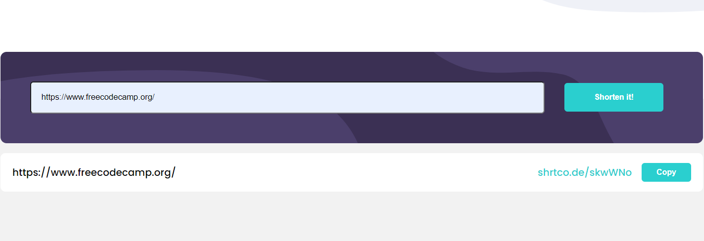

### The challenge

Users should be able to:

- [x] View the optimal layout for the site depending on their device's screen size
- [x] Shorten any valid URL
- [x] See a list of their shortened links, even after refreshing the browser
- [x] Copy the shortened link to their clipboard in a single click
- [x] Receive an error message when the `form` is submitted if:
  - [x] The `input` field is empty

### Links

- Solution URL: [Solution](https://www.frontendmentor.io/solutions/shortly-api-shorten-urls-PfWGE4vKyZ)
- Live Site URL: [LIVE](https://magic-url-shortener.netlify.app/)

### Built with

- HTML5 
- CSS 
- JAVASCRIPT

### Continued development

Right now whenever a user submits a valid link they get a short link in a container below, those links go down the page. I would like to limit them? For example limit to 3, so submitting a new link will remove the last link in the container and so on, to make it seem like a loop, to make old links disappear. So I want to solve this endless container going down the page. 

## Author

- Frontend Mentor - [Abrosss](https://www.frontendmentor.io/profile/Abrosss)
- [Twitter](https://twitter.com/ronessu)

